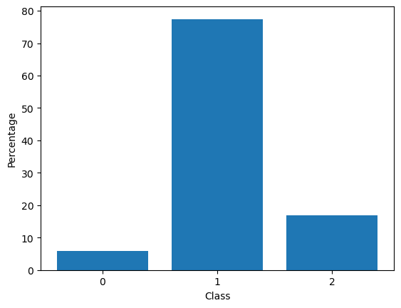
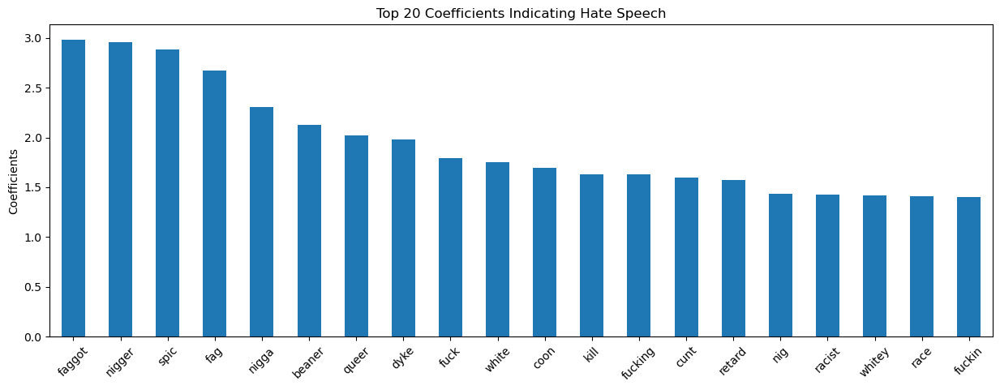
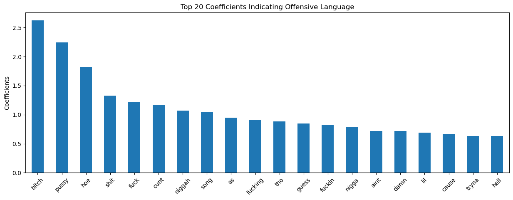
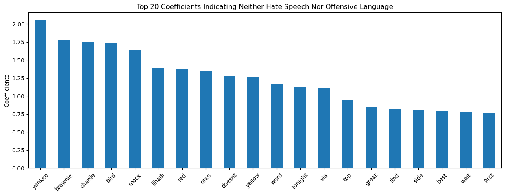

# Content Moderation on Social Media Platforms
## 🔎 Project Overview
My project focuses on leveraging machine learning techniques for content moderation on social media platforms, specifically targeting the automatic detection of harmful texts. Through advanced natural language processing (NLP) methods, we aim to encode textual data into numerical matrices and employ machine learning models for sentiment analysis. By rigorously testing multiple models, we aim to identify the most effective approach in terms of accuracy, precision, and recall.

## 📖 Table of Contents
1. [Project Motivation](#motivation)
2. [The Data](#data)  
3. [Data Dictionary](#dictionary)
4. [Project Roadmap](#roadmap)
5. [Learnings](#learning)
6. [Conclusion](#conclusion)
7. [Next Steps](#next)

## 💪🏽 Project Motivation 
In today's digital age, social media plays a significant role in shaping the lives of teenagers. However, with this widespread influence comes the risk of exposure to harmful content that can negatively impact their mental health. As a concerned individual, I am motivated to create a safer online environment for teens and provide peace of mind for parents. By leveraging the power of machine learning, I aim to develop tools that can effectively identify and mitigate harmful content on social media platforms.

My project aims to address the pressing issue of safeguarding teenagers from the detrimental effects of harmful content circulating on social media platforms. By employing advanced machine learning techniques, we strive to automatically detect and flag texts containing cyberbullying, hate speech, and other harmful material. Through our efforts, teenagers will benefit from a safer online experience, free from the threats of online predators and mental health risks. Furthermore, parents will gain reassurance knowing that proactive measures are in place to protect their children in the digital world. Together, we can make a meaningful impact by promoting online safety and well-being for the younger generation.

## 📊 The Data 
This dataset is a meticulously curated collection of annotated tweets with the specific purpose of detecting hate speech and offensive language. The dataset primarily consists of English tweets and is designed to train machine learning models or algorithms in the task of hate speech detection. It consists of annotated tweets with information about their classification as hate speech, offensive language, or neither. Each row represents a tweet along with the corresponding annotations provided by multiple annotators.

The data collection methodology used to create this dataset involved obtaining tweets from Twitter's public API using specific search terms related to hate speech and offensive language. These tweets were then manually labeled by multiple annotators who reviewed them for classification purposes.

Dataset can be found on Huggingface [hate_speech_offensive](https://huggingface.co/datasets/tdavidson/hate_speech_offensive)

Data quality concerns: Although efforts have been made to ensure the accuracy of the data, it is important to acknowledge that annotations are subjective opinions provided by individual annotators. As such, there may be variations in classifications between annotators.

## 📖 Data Dictionary 
| Column | Data Type | Description |
|--------|-----------|-------------|
| count  | int | The total number of annotations for each tweet.
| hate_speech_count | int | The number of annotations classifying a tweet as hate speech.
| offensive_language_count | int | The number of annotations classifying a tweet as offensive language.
| neither_count | int | The number of annotations classifying a tweet as neither hate speech nor offensive language.
| class | int | The category in which a tweet belongs to.
| tweet | str | The actual text of the tweet.

## 🚙 Project Roadmap 
- [x] Milestone 1: Data Collection
- [x] Milestone 2: Exploratory Data Analysis (EDA)
- [x] Milestone 3: Preprocessing
- [x] Milestone 4: Model Selection
- [x] Milestone 5: Model Evaluation
- [ ] Milestone 6: Model Deployment

Project progression:

I've trained and fine-tuned my models utilizing pipelines and GridSearchCV for the following algorithms:
- Logistic Regression
- Random Forest
- XGBoost

Here is our model summary:

|Model|Vectorizer|Parameters|Train Accuracy (%)|Test Accuracy (%)|F1-Score (weighted avg)|Recall (weighted avg)
|:---:|:---:|:---:|:---:|:---:|:---:|:---:|
|Logistic Regression|CountVectorizer|C=1|83.2|79.3|82|79|
|Random Forest|Sentence2vecTransformer|max_depth=20, n_estimators=900|99.8|82.1|83|82|
|XGBoost|Sentence2vecTransformer|max_depth=4, n_estimators=481|99.8|83.6|85|84|

Based on Accuracy, Precision, Recall and F1 scores, I determined my best model was XGBoost.

## 💡 Learnings 
Some learnings from the EDA and Feature Engineering:
- There are 24783 rows and 6 columns in the dataset.
- There are 0 NULL values in the dataset.
- There are 0 duplicated rows in the dataset.
- Our target column `class` is very imbalanced, with class 1 (offensive language) taking up 77% of the data, class 2(neither) taking up 17% and class 0 (hate speech) only 6%.

- After splitting our data into train and test, we upsampled class 0 and downsampled class 1 so that our training data consists of equal proportions of each class.
- Next, let's look at the top 20 words that are most predictive of each class:

Vectorization:
- I created a custom tokenizer to clean the tweets before putting them into a vectorizer. This function will go through a 3 step process:
1. Remove all punctuation and convert text to lower case.
2. Split the string and remove stop words (common English words found in almost every sentence that will not be useful in predictions).
3. Lemmatize each word in the string (normalize words so that different inflected forms of the same word are treated as the same word).
- I developed a method to generate contextual embeddings that represent words or phrases in a high-dimensional space, capturing semantic similarity. This method utilizes LexVec and Wikipedia as pre-trained word vectors. Additionally, I crafted a custom transformer to seamlessly integrate this functionality into pipelines and gridsearchcv.

## 🎬 Conclusion 
We see that XGBoost is the best performing model in terms of having the highest accuracy, F1 and recall scores. The model performs well in predicting instances belonging to class 1 - offensive language (high precision, recall, and F1-score) and class 2 - neither (high recall and relatively high F1-score), but it performs less well for class 0 - hate speech (low precision, recall, and F1-score). The weighted average precision, recall, and F1-score (0.87, 0.84, and 0.85, respectively) suggest that the model performs reasonably well overall, with some room for improvement, especially for class 0. This looks reasonable because our classes are extremely imbalanced with class 1 having the highest support (3838 instances), followed by class 2 (833 instances), and class 0 (286 instances). The model's overall accuracy is 0.84, indicating that the model correctly predicted 84% of all instances across all classes.

## ⏭️ Next Steps 
The model trained had adequate predictive power, however, next steps from here include:
- Use machine learning to also recognize harmful images, videos, and memes.
- Explore alternative vectorization techniques, such as, finding a pre-trained word vector library that is more suitable for informal languages like tweet.
- Create a streamlit app and a dashboard to display my project and results thus far. 

Features I believe would help create an even better model are:
- User features (e.g. age, gender, location, user reputation).
- Interaction features (e.g. likes, comments, shares)
- Temporal context (e.g. time of postig, trends, and temporal patterns of harmful content).
- Geolocation (e.g. geographic location of the content and its relevance to cultural or regional norms).